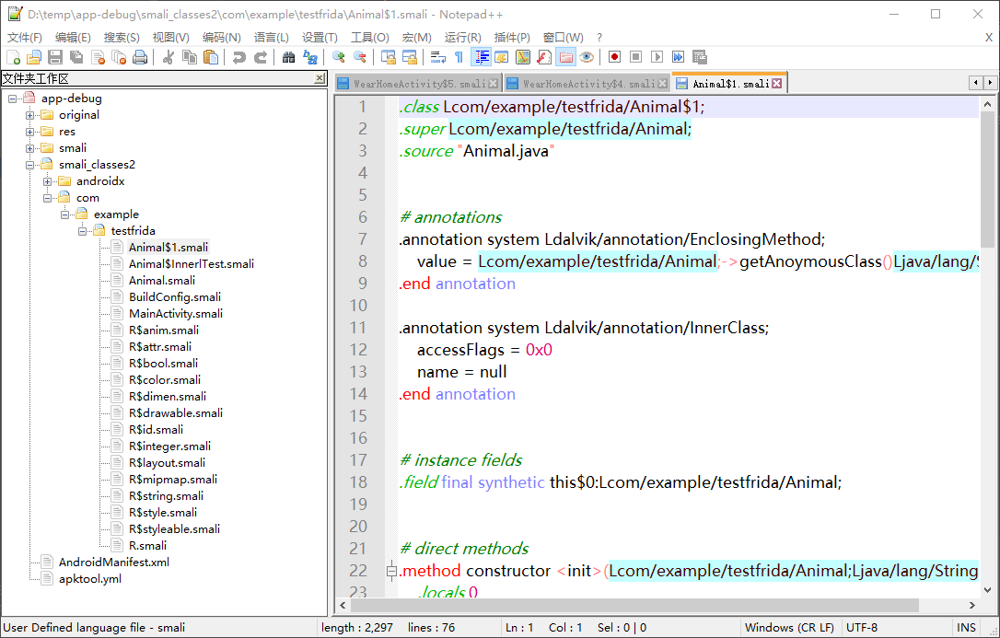
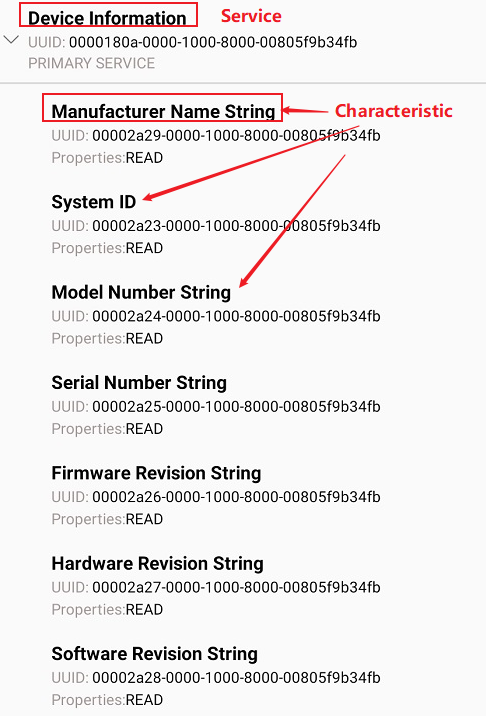

# FridaHookAndroid
Frida-Android 进阶

frida 版本：12.11.18

系统：Ubuntu 20.04 LTS

# 官方 API

## Java 运行时

官方API地址： [https://www.frida.re/docs/javascript-api/#java](https://www.frida.re/docs/javascript-api/)  ，这里给出几个常用的 API

<font color="green">**Java.perform(fn)**</font>

确保当前线程被附加到 VM 上，并且调用`fn`函数。此函数在内部调用 VM::AttachCurrentThread，然后执行 fn 回调函数中的 Javascript 脚本操作 Java 运行时，最后使用 VM::DetachCurrentThread 释放资源。  

<font color="green">**Java.use(className)**</font>

通过类名获得 Java 类，返回一个包裹好的 Javascript 对象。通过该对象，可访问类成员。通过调用 `$new()`调用构造函数，实例化对象。

```javascript
Java.perform(function(){
    var Activity = Java.use("android.app.Activity");	// 反射获取类
    var Exception = Java.use("java.lang.Exception");
    Activity.onResume.implementation = function(){		// 调用构造器抛出异常
        throw Exception.$new("Oh noes!");
    };
});
```

<font color="green">**Java.choose(className, callback)**</font>

在内存中扫描 Java 堆，枚举 Java 对象（className）实例。比如可以使用 `java.lang.String` 扫描内存中的字符串。callbacks 提供两个参数：`onMatch(instance)` 和 `onComplete`，分别是找到匹配对象和扫描完成调用。

<font color="green">**Java.scheduleOnMainThread(fn)**</font>

在 VM 主线程（UI 线程）执行回调函数。Android 中操作 UI 元素需要在主线程中执行代码，`scheduleOnMainThread` 的作用就是用来在主线程中执行函数。此函数需要使用 `Java.perform` 包裹。

```js
Java.perform(function(){
	var Toast = Java.use("android.widget.Toast");
    // 获取 context
	var currentApplication = Java.use("android.app.ActivityThread").currentApplication();
	var context = currentApplication.getApplicationContext();
	// 在主线程中运行回调
	Java.scheduleOnMainThread(function(){
		Toast.makeText(context, "Hello frida!", Toast.LENGTH_LONG.value).show();
	});
});
```

<font color="green">**enumerateLoadedClasses(callbacks)**</font>

枚举当前已加载的类。`callbacks` 参数是一个对象，需要提供两个回调函数—— `onMatch(className)` 和 `onComplete`。每次找到一个类就会调用一次 `onMatch`，全部找完之后，调用 `onComplete`。

# hook 案例

## 通用案例

方法一：运行时 hook

```python
import frida
import sys

def read_js(file):
    with open(file) as fp:
        return fp.read()

def on_message(message, data):
    if message["type"] == "send":
        print("[+] {}".format(message["payload"]))
    else:
        print("[-] {}".format(message))

remote_device = frida.get_usb_device()
session = remote_device.attach("com.example.testfrida")

src = read_js("./test.js")
script = session.create_script(src)
script.on("message", on_message)
script.load()
sys.stdin.read()
```

方法二：spawn 拉起进程

如果需要 hook app 执行 onCreate() 方法中的一些功能，就需要使用 spawn 模式

```shell
frida -U -l test.js -f com.example.testfrida
```

参数

- -U  connect to USB device
- -l  SCRIPT, --load=SCRIPT
- -f  FILE, --file=FILE  spawn FILE

后文中的案例，由于 hook 的显示结果通过 Toast 展示，Toast 会在 app 刚启动时加载。

- 使用方法一，运行时 hook，需要在 app 刚启动时，就运行 python 程序；
- 使用方法二，用 spawn 拉起 app

### 普通方法

```js
Java.perform(function (){
    send("start hook...");
    var Animal = Java.use("com.example.testfrida.Animal");

    Animal.getAnimalInfo.implementation = function (){
        send("hijack getAnimalInfo");
        return "hello, frida!";
    };
});
```

脚本输出结果

```shell
/usr/bin/python3.8 /home/lys/PycharmProjects/honor5/main.py
[+] start hook...
[+] hijack getAnimalInfo
```

### 构造函数

形参类型通过 `overload` 传递

- 可以通过 `arguments` 列表获取待 hook 函数的形参

- 也可以通过`implementation = function (a, b, c...)` 获取

```js
Java.perform(function (){
    send("start hook...");
    var Animal = Java.use("com.example.testfrida.Animal");

    Animal.$init.overload("java.lang.String", "int").implementation = function (){
        send("hijack Animal()");
        send("参数1：" + arguments[0]);
        send("参数2：" + arguments[1]);
        return this.$init("frida", 999);	// 修改
    };
});
```

脚本输出结果

```shell
/usr/bin/python3.8 /home/lys/PycharmProjects/honor5/main.py
[+] start hook...
[+] hijack Animal()
[+] 参数1：duck
[+] 参数2：2
```

### 内部类

内部类的一般写法是 Class$InnerClass，对于混淆的内部类，查看 smali 源码就能看出 $1、$2 这样的类就是内部类。

```js
Java.perform(function (){
    send("start hook...");
    var InnerTest = Java.use("com.example.testfrida.Animal$InnerlTest");

    InnerTest.getClassInfo.implementation = function (){
        send("hijack inner Class");
        return "hello, frida!";
    }
});
```

脚本输出结果

```shell
/usr/bin/python3.8 /home/lys/PycharmProjects/honor5/main.py
[+] start hook...
[+] hijack inner Class
```

### 匿名内部类

查看反编译得到的 smali 源码，smali 文件会将每个类作为一个单独文件保存，如下图所示的 `$1` 就是匿名内部类。



其余用法跟普通类是一样的。

```js
Java.perform(function (){
    send("start hook...");
    var AnoyClass = Java.use("com.example.testfrida.Animal$1");

    AnoyClass.getAnimalInfo.implementation = function (){
        return "hello,frida";	// 修改函数返回值
    };
});
```

匿名内部类 hook 还有一些独特技巧，比如说，如果你不想通过反编译的方式得到匿名内部类的符号，可以直接通过 hook 构造函数的方式获取类名，如下所示

```js
Java.perform(function (){
    send("start hook...");
    var Animal = Java.use("com.example.testfrida.Animal");

    Animal.$init.overload("java.lang.String", "int").implementation = function (){
        send("constructor called from " + this.$className);
        const NewAnimal = Java.use(this.$className);
        NewAnimal.getAnimalInfo.implementation = function (){
            return "hello, frida";
        };
    };
});
```


### 私有属性

如果 app 没有调用 get 等函数，怎么直接获取类的私有属性呢？早期版本的 frida 支持使用 java 提供的反射，js 同样也提供了该功能。

```js
	var objectionInstance = Animal.$new("test", 0);
	var ob = Java.cast(objectionInstance.getClass(), clazz);
        var name = ob.getDeclaredField("name");     // 获得某个属性对象
        var value = ob.get(name);                   // 获得obj中对应的属性值
        send(value);
```

经过多次实践，发现该脚本并不能在笔者的环境中正常运行，后来才发现，新版 frida (笔者使用的版本：12.11.18)支持直接获取类中的私有属性，而不需要使用 Java 的高级特性——反射。

```js
Java.perform(function (){
    send("start hook...");
    var Animal = Java.use("com.example.testfrida.Animal");

    Animal.getAge.implementation = function (){
        send("obtain key");

        // 直接调用类中的函数
        send("call public function >> getName(): " + this.getName());
        send("call private function >> getKey(): " + this.getKey());
        // 直接调用类中的私有属性
        send("call private property >> name: " + this.name.value);
        send("call private property >> age: " + this.age.value);
        send("call private property >> key: " + this.key.value);

        return this.getAge();
    };
});
```

脚本输出结果

```shell
/usr/bin/python3.8 /home/lys/PycharmProjects/honor5/main.py
[+] start hook...
[+] obtain key
[+] call public function >> getName(): penguin
[+] call private function >> getKey(): AEKL3KJK23KLASLDKOCVL
[+] call private property >> name: penguin
[+] call private property >> age: 5
[+] call private property >> key: AEKL3KJK23KLASLDKOCVL
```

修改私有属性也一样简单

```js
		// 修改私有属性
        this.age.value = 9999;
```

## 进阶用法

### 获取内存中加载的所有类

```js
Java.perform(function(){
    send("enumerating classes...");
    Java.enumerateLoadedClasses({
        onMatch: function(className){
            send("found class >> " + className);
        },
        onComplete: function(){
            send("class enumration complete");
        }
    });
});
```

脚本输出结果

```shell
/usr/bin/python3.8 /home/lys/PycharmProjects/honor5/main.py
[+] enumerating classes...
[+] found class >> com.huawei.iaware.IAwareFunctionAL
[+] found class >> com.huawei.iaware.IAwareConstantAL$StringConstants
[+] found class >> com.huawei.iaware.IAwareConstantAL
[+] found class >> com.huawei.iaware.IAwareCallbackAL
[+] found class >> com.huawei.iaware.IAwareCallbackAL$MultiWinCallBackHandlerIAL
[+] found class >> vendor.huawei.hardware.hwsched.V1_0.ISched
...
```

### 获取类中的所有方法

```js
Java.perform(function(){
    send("obtain methods...");

    var Animal = Java.use("com.example.testfrida.Animal");
    var methods = Animal.class.getDeclaredMethods();
    for(var i = 0; i < methods.length; i++){
        console.log(methods[i]);;
    }
});
```

 输出结果

```shell
/usr/bin/python3.8 /home/lys/PycharmProjects/honor5/main.py
[+] obtain methods...
static java.lang.String com.example.testfrida.Animal.access$000(com.example.testfrida.Animal)
static int com.example.testfrida.Animal.access$100(com.example.testfrida.Animal)
private java.lang.String com.example.testfrida.Animal.getKey()
public int com.example.testfrida.Animal.getAge()
public java.lang.String com.example.testfrida.Animal.getAnimalInfo()
public java.lang.String com.example.testfrida.Animal.getAnoymousClass()
public com.example.testfrida.Animal$InnerlTest com.example.testfrida.Animal.getInnerTestInstance()
public java.lang.String com.example.testfrida.Animal.getName()
public void com.example.testfrida.Animal.setAge(int)
public void com.example.testfrida.Animal.setName(java.lang.String)
```

### 打印调用栈

有两种方法可以跟踪函数的调用栈，推荐使用第一种。

1. 直接在脚本中直接输出错误日志
2. 触发异常，在 Android log 中输出

```js
Java.perform(function(){
    send("print stack...");
    var Animal = Java.use("com.example.testfrida.Animal");

    Animal.getAge.implementation = function (){
        console.log(Java.use("android.util.Log").getStackTraceString(Java.use("java.lang.Exception").$new()));
        //throw Java.use("java.lang.Exception").$new();
        return this.getAge();
    };
});
```

1.Python 输出

```shell
/usr/bin/python3.8 /home/lys/PycharmProjects/honor5/main.py
[+] print stack...
java.lang.Exception
	at com.example.testfrida.Animal.getAge(Native Method)
	at com.example.testfrida.MainActivity.getPrivte(MainActivity.java:92)
	at com.example.testfrida.MainActivity.onClick(MainActivity.java:60)
	at android.view.View.performClick(View.java:7216)
	at android.view.View.performClickInternal(View.java:7190)
	at android.view.View.access$3500(View.java:827)
	at android.view.View$PerformClick.run(View.java:27663)
	at android.os.Handler.handleCallback(Handler.java:900)
	at android.os.Handler.dispatchMessage(Handler.java:103)
	at android.os.Looper.loop(Looper.java:219)
	at android.app.ActivityThread.main(ActivityThread.java:8291)
	at java.lang.reflect.Method.invoke(Native Method)
	at com.android.internal.os.RuntimeInit$MethodAndArgsCaller.run(RuntimeInit.java:513)
	at com.android.internal.os.ZygoteInit.main(ZygoteInit.java:1055)
```

2. Android 日志输出

```shell
lys@lys-VirtualBox:~$ adb logcat -s AndroidRuntime
--------- beginning of system
--------- beginning of main
12-19 17:50:22.313 31328 31328 D AndroidRuntime: Shutting down VM
--------- beginning of crash
12-19 17:50:22.314 31328 31328 E AndroidRuntime: FATAL EXCEPTION: main
12-19 17:50:22.314 31328 31328 E AndroidRuntime: Process: com.example.testfrida, PID: 31328
12-19 17:50:22.314 31328 31328 E AndroidRuntime: java.lang.RuntimeException: java.lang.reflect.InvocationTargetException
12-19 17:50:22.314 31328 31328 E AndroidRuntime:        at com.android.internal.os.RuntimeInit$MethodAndArgsCaller.run(RuntimeInit.java:523)
12-19 17:50:22.314 31328 31328 E AndroidRuntime:        at com.android.internal.os.ZygoteInit.main(ZygoteInit.java:1055)
12-19 17:50:22.314 31328 31328 E AndroidRuntime: Caused by: java.lang.reflect.InvocationTargetException
12-19 17:50:22.314 31328 31328 E AndroidRuntime:        at java.lang.reflect.Method.invoke(Native Method)
12-19 17:50:22.314 31328 31328 E AndroidRuntime:        at com.android.internal.os.RuntimeInit$MethodAndArgsCaller.run(RuntimeInit.java:513)
12-19 17:50:22.314 31328 31328 E AndroidRuntime:        ... 1 more
12-19 17:50:22.314 31328 31328 E AndroidRuntime: Caused by: java.lang.Exception
12-19 17:50:22.314 31328 31328 E AndroidRuntime:        at com.example.testfrida.Animal.getAge(Native Method)
12-19 17:50:22.314 31328 31328 E AndroidRuntime:        at com.example.testfrida.MainActivity.getPrivte(MainActivity.java:92)      
12-19 17:50:22.314 31328 31328 E AndroidRuntime:        at com.example.testfrida.MainActivity.onClick(MainActivity.java:60)        
12-19 17:50:22.314 31328 31328 E AndroidRuntime:        at android.view.View.performClick(View.java:7216)
12-19 17:50:22.314 31328 31328 E AndroidRuntime:        at android.view.View.performClickInternal(View.java:7190)
12-19 17:50:22.314 31328 31328 E AndroidRuntime:        at android.view.View.access$3500(View.java:827)
12-19 17:50:22.314 31328 31328 E AndroidRuntime:        at android.view.View$PerformClick.run(View.java:27663)
12-19 17:50:22.314 31328 31328 E AndroidRuntime:        at android.os.Handler.handleCallback(Handler.java:900)
12-19 17:50:22.314 31328 31328 E AndroidRuntime:        at android.os.Handler.dispatchMessage(Handler.java:103)
12-19 17:50:22.314 31328 31328 E AndroidRuntime:        at android.os.Looper.loop(Looper.java:219)
12-19 17:50:22.314 31328 31328 E AndroidRuntime:        at android.app.ActivityThread.main(ActivityThread.java:8291)
12-19 17:50:22.314 31328 31328 E AndroidRuntime:        ... 3 more
```

## 助理函数

### ArrayBuffer 转换

```js
function ab2Hex(buffer) {
    var arr = Array.prototype.map.call(new Uint8Array(buffer), function (x) {return ('00' + x.toString(16)).slice(-2)}).join(" ").toUpperCase();
    return "[" + arr + "]";
}
 
function ab2Str(buffer) {
    return String.fromCharCode.apply(null, new Uint8Array(buffer));
}
```

### 获取 JS 对象类型

```js
function getParamType(obj) {
    return obj == null ? String(obj) : Object.prototype.toString.call(obj).replace(/\[object\s+(\w+)\]/i, "$1") || "object";
}
```

例如

```js
Java.perform(function(){
    send("obtain methods...");

    var Animal = Java.use("com.example.testfrida.Animal");
    var methods = Animal.class.getDeclaredMethods();

    console.log(getParamType(Animal));
    console.log(getParamType(methods));
    console.log(Animal.class);
});
```

输出

```js
/usr/bin/python3.8 /home/lys/PycharmProjects/honor5/main.py
[+] obtain methods...
Object
Array
class com.example.testfrida.Animal
```

### 字节数组转十六进制

```js
// thanks: https://awakened1712.github.io/hacking/hacking-frida/
function bytes2hex(array) {
    var result = '';
    for (var i = 0; i < array.length; ++i)
        result += ('0' + (array[i] & 0xFF).toString(16)).slice(-2);
    return result;
}
```

# 典型案例

## hook BLE

### 分析

简要说明一下，在 BLE 协议栈中 ，有几个关键概念

- **GATT**：通过 BLE 连接，读写属性类数据的 Profile 通用规范
- **Characteristic**：特征，可以理解为一个数据类型，包括 value 和 descriptor（特征值和描述）
- **descriptor**：是对 Characteristic 的描述，如范围、计量单位等
- **Service**：一组 Characteristic 的集合

**一个蓝牙设备有多个 profile，每个profile 有多个 service，每个 service 有多个 characteristic**

例如，一个名为“Device Information”的 Service，可能包含多个 Characteristics，比如 “Manufacture Name String”，每个名字在编程中，都有一个统一的表示方法，唯一识别，这就是 UUID。



在 Android SDK 中，低功耗蓝牙使用`BluetoothGattCallback` 提供的回调，调用 `onCharacteristicWrite` /Read 方法进行读写，具体用法可参见 https://developer.android.com/reference/android/bluetooth/BluetoothGattCallback。

Android SDK 的 BLE 编程，通过 `BluetoothDevice` 类中的 `connectGatt` 注册 GATT 回调函数，在回调中完成读写操作。

```java
final BluetoothDevice device = mBluetoothAdapter.getRemoteDevice(address);	// 得到设备
mBluetoothGatt = device.connectGatt(this, false, mGattCallback);	//注册回调函数
// 回调函数的实现
private final BluetoothGattCallback mGattCallback = new BluetoothGattCallback(){
    // 重写Servcie/Characteristic的各个操作，读写数据的方法
}
```

### hook

所以，想要 hook 住与设备传输的蓝牙数据，必然是拦截 `BluetoothGattCallback` 这个构造方法。

开源项目：https://github.com/optiv/blemon/blob/master/frida/blemon.js 给了我们一个很好的案例，掌握这些回调函数以及 Frida hook 蓝牙的一些方法。

```js
if (Java.available) {
    Java.perform(function () {
        var BTGattCB = Java.use("android.bluetooth.BluetoothGattCallback");
        // 想 hook 匿名内部类的函数，从父类的构造方法入手
        BTGattCB.$init.overload().implementation = function () {
            console.log("[+] BluetoothGattCallback constructor called from " + this.$className);
            // 当前hook的类匿名类
            const NewCB = Java.use(this.$className);
            NewCB.onCharacteristicRead.implementation = function (g, c, s) {
                const retVal = NewCB.onCharacteristicRead.call(this, g, c, s);
                var uuid = c.getUuid();
                console.log(Color.Blue + "[BLE Read   <=]" + Color.Light.Black + " UUID: " + uuid.toString() + Color.Reset + " data: 0x" + bytes2hex(c.getValue()));
                return retVal;
            };
            NewCB.onCharacteristicWrite.implementation = function (g, c, s) {
				// ...
            };
            NewCB.onCharacteristicChanged.implementation = function (g, c) {
				// ...
            };
            return this.$init();
        };

    }); // end perform
} 
```


